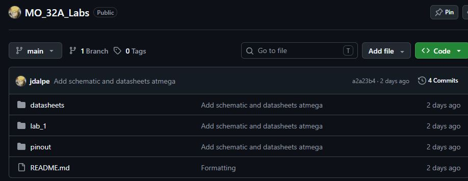
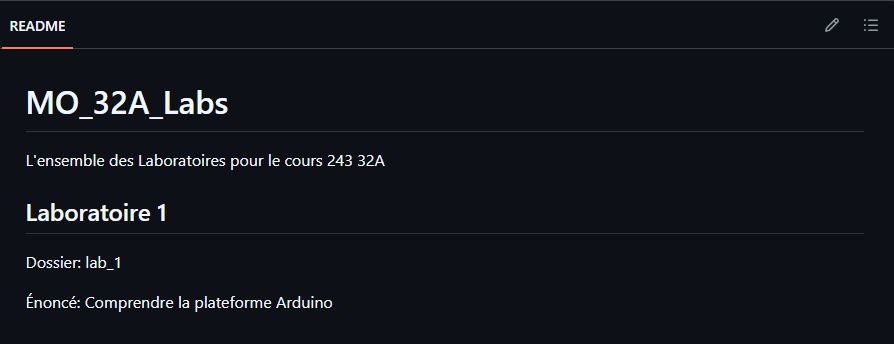

# Laboratoire 1 / Partie 1

## Partie 1:
- Comprendre comment accéder au Github
- Comprendre l'interface Arduino
- Connaître les I/O du AtMega

### Github

Github est un ensemble de Git Repository. Il y a 3 platformes principales pour les projets de type 'open-source'. 

- https://gitlab.com/
	- GitLab est une compagnie.
- https://bitbucket.org/
	- Bitbucket appartient à Atlassian, une compagnie très présente en informatique, ils ont aussi la plateform JIRA qui est rendu un 'must' en développement logiciel.
- https://github.com/
	- Acheté par Microsoft, c'est la plateforme la plus grande des 3.

#### Comment utiliser le Git Repo pour le cours? 

Vous avez 3 façons d'utiliser la plateforme. Via le web, en copie local ou en git local.

Pour visualiser les README.md, utiliser la plateforme Web, les images seront directement affiché et vous n'aurez pas à 'chercher' ce que les commandes dans le README.

Pour télécharger les informations (Le code ET le document de questions), utiliser le git local. Il est possible d'utiliser la copie local, mais c'est une bonne habitude d'utiliser Git directement.

###### Plateforme Web

En cliquant sur un fichier dans le navigateur, par défaut, le README sera affiché.

