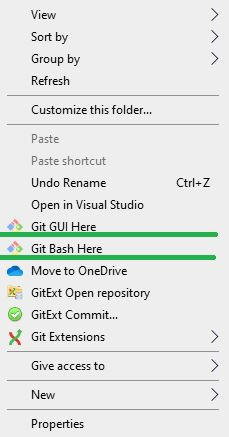
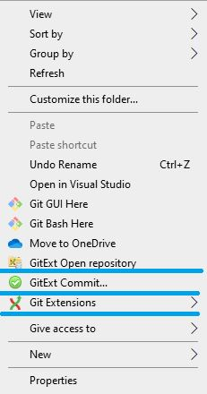
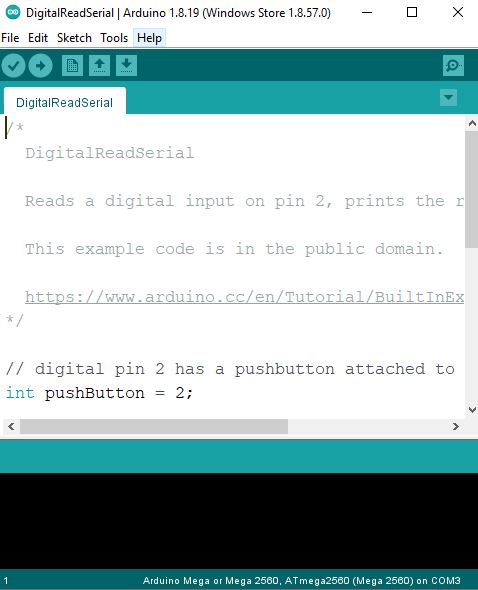
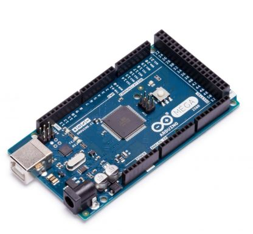
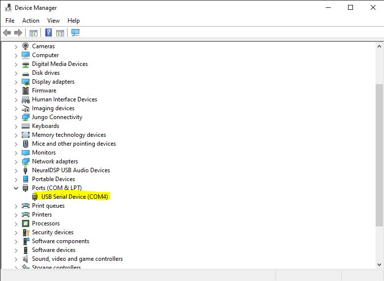
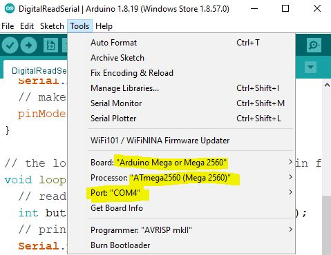
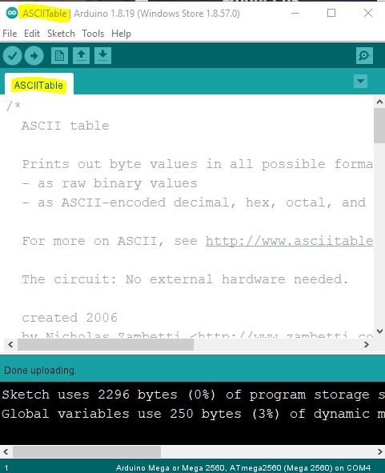
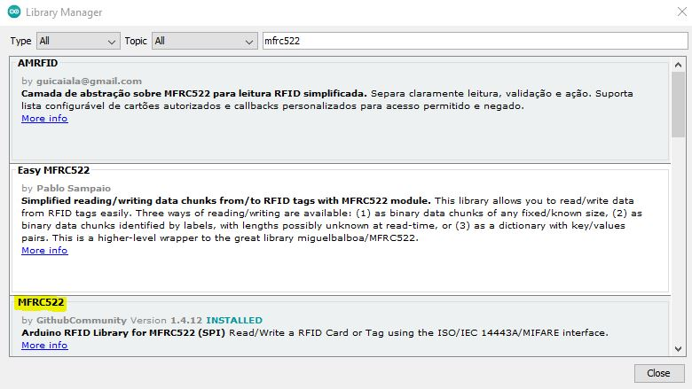
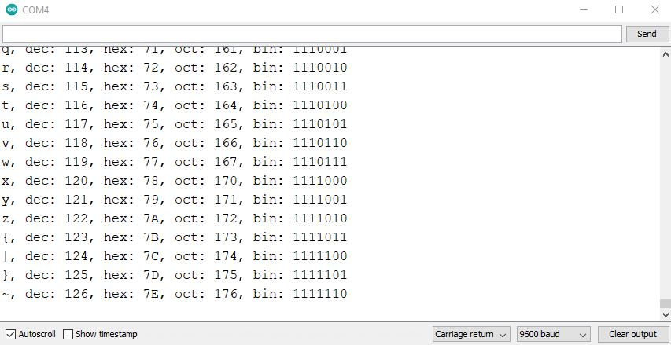

# Laboratoire 1 / Partie 1


## Partie 1:
- Comprendre comment accéder au Github
- Comprendre l'interface Arduino
- Connaître les I/O du AtMega


# GitHub

GitHub est un ensemble de Git Repository. Il y a 3 platformes principales pour les projets de type 'open-source'. 

- https://gitlab.com/
	- GitLab est une compagnie.
- https://bitbucket.org/
	- Bitbucket appartient à Atlassian, une compagnie très présente en informatique, ils ont aussi la plateform JIRA qui est rendu un 'must' en développement logiciel.
- https://github.com/
	- Acheté par Microsoft, c'est la plateforme la plus grande des 3.

#### Comment utiliser le Git Repo pour le cours? 

Vous avez 3 façons d'utiliser la plateforme. Via le web, en copie local ou en git local.

Pour visualiser les README.md, utiliser la plateforme Web, les images seront directement affiché et vous n'aurez pas à 'chercher' ce que les commandes dans le README.

Pour télécharger les informations (Le code ET le document de questions), utiliser le git local. Il est possible d'utiliser la copie local, mais c'est une bonne habitude d'utiliser Git directement.

-----

## Plateforme Web

Voici l'arborescence des fichiers / Le File Tree


En cliquant sur un fichier dans le navigateur, par défaut, le README sera affiché.


> $\color{gray}{\text{MANIPULATION}}$ **Naviguer dans GitHub**
> 
> Naviguer dans l'arbre des fichiers et trouver ou se trouve les 
> images dans ce README.
> 

-----

## Copy local

À tout moment, un Git Repo peut être copier d'un GitHub/GitLab/BitBucket.

- Allez dans l'onglet `code`


- Sélectionner `Download ZIP`

- Dézipper pour avoir la copie de la branche `main`
	- Si vous avez une mise à jour, le fochier doit être téléchargé à nouveau

-----

## Git Local

Pour utiliser Git, il faut télécharger au minimum d'outils en ligne de commande. 

https://git-scm.com/install/windows


Pour visualiser la structure Git avec un interface, il faut aussi un autre programme.

https://git-scm.com/downloads/guis?os=windows

- Il y a un ensemble de choix pour votre OS, je conseille:
	- GitHub Desktop: Pour les projets GitHub exclusif
	- Git Extensions: Pour les utilisateurs de Windows
	- git-cola: Pour les utilisateurs de Linux et MacOS


> $\color{gray}{\text{MANIPULATION}}$ **Installer Git**
> 
> Installer Git sur votre ordinateur. 
> Vous aurez accès à l'outils `Git Bash` ainsi qu'à `Git GUI`
> Pour ce laboratoire, nous allons utiliser le `BASH` uniquement
> 

Une fois Git installer, vous aurez une nouvelle fonction via le click-droit de votre souris:



#### Ordinateur de l'école
Git bash est déjà installer, mais n'est pas lié au click-droit.

- Ouvrir Git Bash et naviguer vers le bureau ou votre clé USB

```
cd Desktop
##OU
cd /d/
##Votre disque autre que c 

```

Pour copier le Git Repo sur votre ordinateur, sélectionner `Git Bash`

Via la ligne de commande GIT (De type Linux). Cloner le Repo:

```
git clone https://github.com/jdalpe/MO_32A_Labs.git
```

Le lien du GitHub se trouve dans la section `HTTPS` du menu `clone`


> $\color{gray}{\text{MANIPULATION}}$ **Fetching**
> 
> Utiliser la commande Git et copier l'arbre du Repo sur votre ordinateur.
> 
> 

-----

##### Git Extensions

Si vous voulez essayer Git Extensions, l'interface sera aussi disponible via click-droit:




##### Mettre à jour le Git Repo

Pour suivre le développement actif des répertoires, vous pouvez simplement appliquer des `patch`. Une façon très simple est d'utiliser le `Git Bash` dans le fichier et d'écrire:

```
git pull
```

Pour une version plus précise, voici les commandes:

```
git fetch
git rebase origin/main
```


> $\color{gray}{\text{MANIPULATION}}$ **Pull et Fetch**
> 
> Utiliser cette commande si le Git Repo a été mis à jour en ligne. 
> Pour le savoir, on peut aussi utiliser la même commande et si le message
> est: `Already up-to-date`. Le tout était déjà à jour.
> 
> Pour un code `open-source`, il est conseiller d'utiliser cette commande 
> à chaque fois qu'on veut aussi le mettre à jour. Cela évite les conflits
> 

-----

# Arduino IDE

Pour l'ensemble du cours 32A, nous allons utiliser l'IDE (Integrated Development Environment) de Arduino. Cette IDE permet l'intégration rapide de librairies et une compilation direct du micro-contrôleur. 

https://www.arduino.cc/en/software/

Nous allons profiter de certaines librairies déjà intégrer à l'environment pour nous concentrer sur les protocoles numériques.

Voici l'interface de l'Arduino IDE:



Les 2 boutons les plus utilisés sont:


- Vérify: Vérifier les erreurs de compilations
- Upload: Créer l'exécutable et l'envoyer au micro-contrôleur

**NOTE**: Si le code n'est pas `Vérifier`, le bouton `Upload` fera une vérification.

**NOTE**: Cette IDE est très précis dans l'arbre de fichier de programmation. Le fichier sera un `.ino` et le tout dans être dans un dossier du même nom. (Exemple: `blink/blink.ino`)

> $\color{gray}{\text{MANIPULATION}}$ **Installer Arduino IDE**
> 
> Télécharger l'IDE et assurez-vous qu'il est bien installer
> Le tout est déjà installer sur votre station de travail
> 
> 

## Arduino Mega



Pour utiliser la plateforme Arduino Mega, brancher le fils USB B à un ordinateur. 

- Sur Windows, le driver `COM Port` sera initialisé et un chiffre sera associer. L'interface Arduino pourra aussi détecter le chiffre. Via la `Device Manager`:



- Sur Linux, l'interface `ttyACM0` sera disponible. (Ou `ttyUSB0` pour les systèmes plus récent)

### Configuration du Arduino Mega

L'arduino IDE a un ensemble de micro-contrôleur déjà connu, nous devons aller selectionner le bon ET la bonne interface. Dans le cas de cette exemple, il s'agit du `COM4`.



### Utilisation d'exemples

Il est possible de tester l'Arduino Mega avec des programmes d'exemples. Comme nous avons besoin de la communication `Serial` pour l'ensemble de nos laboratoires, utilisons: `File/Examples/04.Communication/ASCIITable`. Une autre fenêtre de l'IDE s'ouvrira. Fermer l'ancienne.



### Librairies?

L'IDE vient avec un répertoire de sous programme ou `Library`. Le tout est accessible via `Tools/Manage Libraries`. L'interface prend un certain temps à s'ouvre et fait une recherche des dernières librairies (Mis a jour fréquemment)

Dans la barre blanche en haut, on peut trouver un micro-contrôleur ou un module qu'on aimerait utiliser pour avoir la librairie directement. Essayer le `MFRC522`. 

> $\color{gray}{\text{MANIPULATION}}$ **Librairies!!**
> 
> Vous pouvez voir un exemple sur le bureau de l'enseignant. 
> Le circuit est une fusion des librairies FastLED et MFRC522. 
> 




### Interface Sérielle

Finalement, l'Arduino IDE contient un outil de débogage très utile appelé: `Serial Monitor`. Pour l'ouvrir, aller dans `Tools/Serial Monitor`.

**NOTE**: Asurez-vous d'avoir sélectionner la bonne interface `COM`. Pendant l'installation (Le `Upload`), l'interface est utilisée comme ligne d'écriture. Le `Serial Monitor` sera grisé ou affichera des caractères incohérent, le tout est normal.



Pour votre application, utiliser toujours l'option `Autoscroll`. La zone en haut est pour `l'écriture(Tx)`. La section la plus grande est pour `la lecture(Rx)`. L'option `Carriage return` est pour l'écriture, chaque envoie aura le caractère `\r` à la fin. Vous pouvez selectionner avec `\n` aussi. L'option `baud` est la plus importante, il faut que la bande soit exactement celle de votre programme. Le protocole utilisé par votre ligne USB est le UART, la synchronisation est **SANS** pin d'horloge.

L'option `Clear output` vide simplement la transmission de données. 

L'option `Show timestamp` ajoutera l'heure de votre ordinateur pour la réception de chaque ligne. C'est une option utile si le délai doit être mesuré, mais le formattage visuelle sera affecté.

> $\color{darkred}{\text{À VÉRIFIER}}$ **Environnement complet**
>
> Brancher votre Arduino Mega, USB seulement, et configurer l'Arduino IDE.
> Tester l'ensemble des boutons (`Verify` et `Upload`) via un programme 
> d'exemple (ASCIITable).
> 
> S'assurer que le programme compile et envoie l'information sur l'interface
> sérielle.
>

-----

# ATMega

Votre plateforme Arduino Mega est fabriquer autour d'un micro-contrôleur, le Atmel ATMega 2560. Avant de commencer la programmation, reviser les options (`Features`) via la `datasheet`. 

> $\color{gray}{\text{MANIPULATION}}$ **ATMega datasheet**
> 
> Ouvrir le PDF atmet-2549-8-bit...pdf.
> Trouvez la section `Features`.
> 
> 
