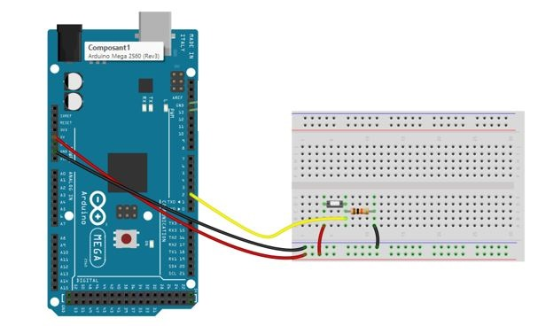
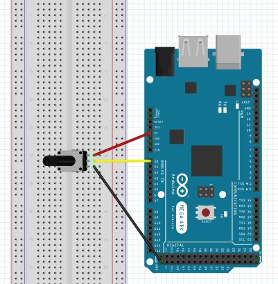
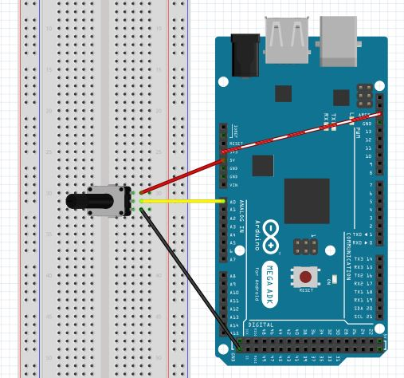

# Laboratoire 1 / Partie 2


## Partie 2:
- Input et Output basique
- Input sans résistance (`Pull-Up` et `Pull-Down`)
- ADC


# Input et Output de base 

La fonction la plus simplement sur un micro-contrôleur est `IO` ou plus précisement `GPIO` (General Purpose Input/Output). En français, on parle d'intrants et d'extrants. Dans le cadre de ce cours, nous allons faire réference au broche (pin) dans la fiche technique (datasheet). Nous allons donc parler de `pin input/output dans la datasheet`.

Pour un compte-rendu écrit ou un examen, les deux termes seront acceptés. (Pareillement pour DEL/LED)

Commençons par un exemple de programme et un exemple de circuit via Arduino.



> $\color{gray}{\text{MANIPULATION}}$ **Input**
>
> Utiliser l'exemple `01.Basic/DigitalReadSerial` via le circuit ci-dessus.
> Résistance 10 kΩ
> 
> 


> $\color{darkred}{\text{À VÉRIFIER}}$ **Input Eval**
>
> Montrer à l'enseignant le `Serial Monitor`. 
> Décrivez dans vos mots ce qui se produit dans ce programme.

-----

Ajoutons une DEL (LED) au circuit. Le ATMega fourni 20mA par Output, une résistance sur une DEL 5mm standard n'est donc pas nécessaire. 

> $\color{gray}{\text{MANIPULATION}}$ **Output**
>
> En utilisant le même code, modifier pour avoir un `output` sur la pin 3.
> (En plus du `input` sur la pin 2)
> 
> La fonction `pinMode` servira a la définition. La fonction `digitalWrite`
> sera utile pour le contrôle. 
> 
> https://docs.arduino.cc/language-reference/en/functions/digital-io/digitalwrite/
> 
> https://docs.arduino.cc/language-reference/en/functions/digital-io/pinMode/
> 
> Connecter une DEL à la broche 3. Placer la DEL via `cathode commune`.
>
> Comportement attendu: Quand le signal de 2 est HIGH, allumer la DEL 3.
>


> $\color{darkred}{\text{À VÉRIFIER}}$ **Output Eval**
>
> Montrer à l'enseignant le `Serial Monitor` et la DEL. 
> Décrivez dans vos mots ce qui se produit dans ce programme.

-----

$\color{red}{\text{ATTENTION!!}}$ **Quand on touche au VCC/GND ET qu'on a un risque de court-circuit. Enlever l'alimentation USB pendant votre branchement. Vous pouvez surcharger votre port USB et un reset de votre ordinateur sera nécessaire.**

# Input Pull-up

Comme discuté dans le cours, il est possible d'utiliser des Pull-up ou Pull-down si le micro-contrôleur a une fonction. Dans le cas des ATMega, uniquement Pull-Up est disponible.

> $\color{gray}{\text{MANIPULATION}}$ **Input 2**
>
> Toujours avec le même code, transformer votre pin 2 en `Input Pull Up`.
>
> https://docs.arduino.cc/language-reference/en/functions/digital-io/pinMode/
> 
> Comme `Pull-up` tire le courant vers le haut, enlever le courant de 5V 
> sur votre bouton, enlever la résistance et reconnecter votre bouton.
> 
> Laisser la DEL telquel.

> $\color{darkred}{\text{À VÉRIFIER}}$ **Input Pull Up Eval**
>
> Montrer à l'enseignant le `Serial Monitor` et la DEL. 
> Décrivez dans vos mots ce qui se produit dans ce programme.


----

# ADC (Analog to Digital Converter)

Les ADCs ou CAN en français (Convertisseur analogique-numérique) sont des fonctions très puissante sur un micro-contrôleur. Via la comparaison binaire (Ici en 10 bits), on peut lire le courant analogique et l'utiliser dans la programmation.

Nous n'allons pas les utiliser, mais il y a aussi un équivalent inverse, les DAC (Digital to Analog Converter). Très utilisé dans la reconstruction de signaux audios.




```
int sensorPin = A0;  
int sensorValue = 0;  

void setup() {
  Serial.begin(9600);
}

void loop() {
  sensorValue = analogRead(sensorPin);
  Serial.print("Value: ");
  Serial.println(sensorValue);
  delay(10);
}

```

> $\color{gray}{\text{MANIPULATION}}$ **ADC simple**
>
> Assembler le circuit ci-dessus.
> 
> Via le Arduino IDE, utiliser le code ci-dessus
> 
>

Un ADC donne une valeur sur son nombre total de bits (ici 10 -> 1024).

Pour calculer la tension, prenons `sensorValue`:

```
vcc = 5
bits = 10
sensorValue = analogRead(sensorPin)

tension = sensorValue/(2^bits) * vcc

2^bits -->  1024
Exemple: sensorValue = 400

400/1024 = 0.390625
0.390625 * 5 = 1.95 V


```

**NOTE** Si vous voulez tester d'afficher la tension, assurez-vous de placer vos valeurs en `float` avant. Des divisions par nombre entier vont avoir des erreurs:

```
# Entier (int/long)
a = 400/1024 
a = 0

# Nombre floatant (float/double)
a = 400*1024
a = 0.390625
```

> $\color{darkred}{\text{À VÉRIFIER}}$ **ADC Eval**
>
> Montrer à l'enseignant le `Serial Monitor`. 
> Décrivez dans vos mots ce qui se produit dans ce programme.

----

La valeur affichée est en 10-bit sur la référence (5V).

Connecter le AREF (Aussi appelé `VRef`) dans le 3.3V et ajouter `analogReference(EXTERNAL);` dans `setup()`



> $\color{darkred}{\text{À VÉRIFIER}}$ **ADC ARef**
>
> Montrer à l'enseignant le `Serial Monitor`. 
> Que ce passe-t-il avec et sans `analogReference(EXTERNAL);` ?

