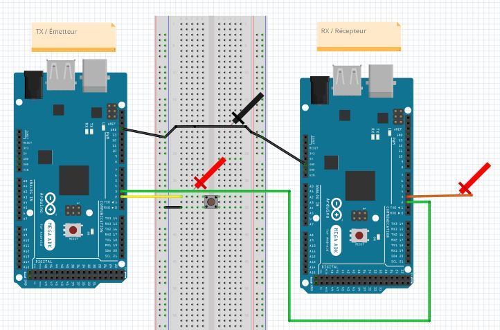
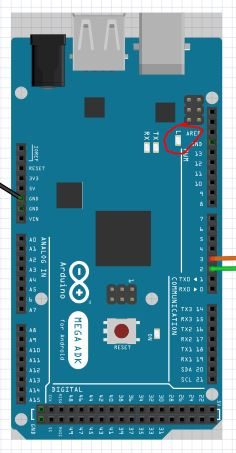
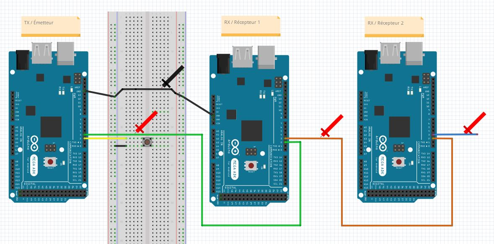

# Laboratoire 1 / Partie 4


## Partie 4:
- Communication intermatérielle


# Émetteur [Tx] - Récepteur [Rx] (Équipe de 2 seulement)

Les protocoles servent dans plusieurs configurations, que nous allons voir en classes théoriques. Mais le concept de base est d'envoyer de l'information entre A et B.

Placez-vous avec un étudiant pour la dernière étape. Définissez votre rôle Émetteur (`Transmit [Tx]`) ou Récepteur (`Receive [Rx]`).



> $\color{gray}{\text{MANIPULATION}}$ **En équipe**
>
> - Faire le circuit ci-dessus.
> - Placer la sonde 1 de l'oscilloscope sur le fil `vert`.
> - Placer la sonde 2 de l'oscilloscope sur le fil `orange`.
> 

> $\color{gray}{\text{MANIPULATION}}$ **Émetteur / Tx SEULEMENT**
>
> Écrire le code requis pour l'émetteur, voici la procédure a réaliser en pseudo-code
> ```
> setup()
>   Initialiser le terminal à 9600
>   Pin 2 input pull-up
>   Pin 3 output
>   Pin 3 = 0
> loop()
>   si pin 2 = 0
>      Terminal: "bouton activé"
>      pin 3 = 1
>      delai 500ms
>      Terminal: "bouton désactivé"
>      pin 3 = 0
>      
> ```

Pour le récepteur, nous allons aussi utiliser la broche 13 pour une DEL, mais au lieu de la brancher, nous allons profiter du Arduino Mega qui a déjà une lumière en `surface-mount`.



> $\color{gray}{\text{MANIPULATION}}$ **Récepteur / Rx SEULEMENT**
>
> Écrire le code requis pour le récepteur, voici la procédure a réaliser en pseudo-code
> ```
> setup()
>   Initialiser le terminal à 9600
>   Pin 2 input pull-up
>   Pin 3 output
>   Pin 13 output
>   Pin 3 = 0
>   Pin 13 = 0
> loop()
>   si pin 2 = 1
>      Terminal: "réception"
>      pin 3 = 1
>      pin 13 = 1
>      delai 500ms
>      Terminal: "réception terminer"
>      pin 3 = 0
>      pin 13 = 0
>      
> ```


> $\color{darkred}{\text{À VÉRIFIER}}$ **Rx/Tx Eval**
>
> Montrer à l'enseignant le `Serial Monitor`, la DEL ainsi que le signal sur la pin 3 (Oscilloscope sur la pin 3 des 2 Arduinos). 
> Décrivez dans vos mots ce qui se produit dans ce programme.
> 

Le print `réception` est placé avant la pin, le `delay` n'est cependant pas affecté, car la librairie `Serial` utilise les interruptions et les 
compteurs interne.

> $\color{gray}{\text{MANIPULATION}}$ **Récepteur Bloquant**
>
> Pour voir l'impact du temps de transmission du protocole UART, ajouter
> `Serial.flush();` entre l'envoi `Serial` et `pin 3 = 1`.
> 

> $\color{darkred}{\text{À VÉRIFIER}}$ **Rx/Tx Eval Bloquant**
>
> Montrer à l'enseignant le signal sur la pin 3 (Oscilloscope sur la pin 3 des 2 Arduinos). 
> 
> Au lieu de `réception`, écriver un très long message.
> Montrer à l'enseignant le signal sur la pin 3 (Oscilloscope sur la pin 3 des 2 Arduinos). 
> 

> $\color{darkgreen}{\text{QUESTIONS}}$ **Remettez le document questions.docx rempli via Teams**
>
> Laboratoire 1 fini!


# Émetteur [Tx] - Récepteur [Rx] (Équipe de 3 seulement)

Les protocoles servent dans plusieurs configurations, que nous allons voir en classes théoriques. Mais le concept de base est d'envoyer de l'information entre A et B. Pour cette équipe de 3, nous allons avoir: Émetteur -- Recepteur 1 -- Récepteur 2

Placez-vous avec 2 étudiants pour la dernière étape. Définissez votre rôle Émetteur (`Transmit [Tx]`) ou Récepteur1 (`Receive [Rx]`) ou Récepteur2 (`Receive [Rx]`).

**NOTE** Avec 3 stations pour contrôler votre circuit, aller au magasin ou demander à l'enseignant pour un fil USB plus long. Demander aussi une troisième sonde d'oscilloscope.



> $\color{gray}{\text{MANIPULATION}}$ **En équipe**
>
> - Faire le circuit ci-dessus.
> - Placer la sonde 1 de l'oscilloscope sur le fil `vert`.
> - Placer la sonde 2 de l'oscilloscope sur le fil `orange`.
> - Placer la sonde 3 de l'oscilloscope sur le fil `bleu`.
> 

> $\color{gray}{\text{MANIPULATION}}$ **Émetteur / Tx SEULEMENT**
>
> Écrire le code requis pour l'émetteur, voici la procédure a réaliser en pseudo-code
> ```
> setup()
>   Initialiser le terminal à 9600
>   Pin 2 input pull-up
>   Pin 3 output
>   Pin 3 = 0
> loop()
>   si pin 2 = 0
>      Terminal: "bouton activé"
>      pin 3 = 1
>      delai 500ms
>      Terminal: "bouton désactivé"
>      pin 3 = 0
>      
> ```

Pour le récepteur, nous allons aussi utiliser la broche 13 pour une DEL, mais au lieu de la brancher, nous allons profiter du Arduino Mega qui a déjà une lumière en `surface-mount`.


> $\color{gray}{\text{MANIPULATION}}$ **Récepteur 1 / Rx SEULEMENT**
>
> Écrire le code requis pour le récepteur, voici la procédure a réaliser en pseudo-code
> ```
> setup()
>   Initialiser le terminal à 9600
>   Pin 2 input pull-up
>   Pin 3 output
>   Pin 13 output
>   Pin 3 = 0
>   Pin 13 = 0
> loop()
>   si pin 2 = 1
>      Terminal: "réception"
>      pin 3 = 1
>      pin 13 = 1
>      delai 500ms
>      Terminal: "réception terminer"
>      pin 3 = 0
>      pin 13 = 0
>      
> ```

> $\color{gray}{\text{MANIPULATION}}$ **Récepteur 2 / Rx SEULEMENT**
>
> Écrire le code requis pour le récepteur, voici la procédure a réaliser en pseudo-code
> ```
> setup()
>   Initialiser le terminal à 9600
>   Pin 2 input pull-up
>   Pin 3 output
>   Pin 13 output
>   Pin 3 = 0
>   Pin 13 = 0
> loop()
>   si pin 2 = 1
>      Terminal: "réception 2"
>      pin 3 = 1
>      pin 13 = 1
>      delai 500ms
>      Terminal: "réception 2 terminer"
>      pin 3 = 0
>      pin 13 = 0
>      
> ```


> $\color{darkred}{\text{À VÉRIFIER}}$ **Rx/Tx/Tx Eval**
>
> Montrer à l'enseignant le `Serial Monitor`, la DEL ainsi que le signal sur la pin 3 (Oscilloscope sur la pin 3 des 3 Arduinos). 
> Décrivez dans vos mots ce qui se produit dans ce programme.
> 

Le print `réception` est placer avant la pin, le `delay` n'est cependant pas affecté, car la librairie `Serial` utilise les interruptions et les 
compteurs interne.

> $\color{gray}{\text{MANIPULATION}}$ **Récepteur (2X) Bloquant**
>
> Pour voir l'impact du temps de transmission du protocole UART, ajouter
> `Serial.flush();` entre l'envoi `Serial` et `pin 3 = 1`.
> 

> $\color{darkred}{\text{À VÉRIFIER}}$ **Rx/Tx/Tx Eval Bloquant**
>
> Montrer à l'enseignant le signal sur la pin 3 (Oscilloscope sur la pin 3 des 3 Arduinos). 
> 
> Au lieu de `réception`, écriver un très long message. (Pour les 2 récepteurs)
> Montrer à l'enseignant le signal sur la pin 3 (Oscilloscope sur la pin 3 des 3 Arduinos). 
> 

> $\color{darkgreen}{\text{QUESTIONS}}$ **Remettez le document questions.docx rempli via Teams**
>
> Laboratoire 1 fini!