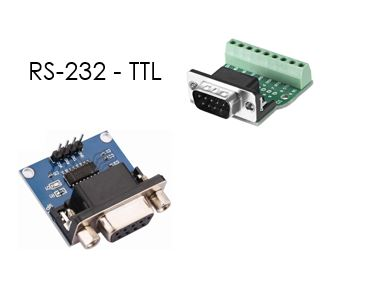
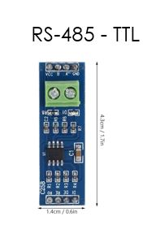
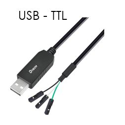
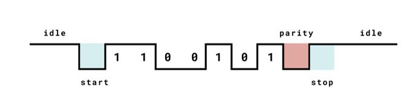

# Laboratoire 2
Énoncé: UART

Pondération:
- Partie 1: 20%
- Partie 2: 20%
- Partie 3: 20%
- Partie 4: 20%
- Partie 5: 20%

## Matériels
- 1 X Arduino Mega 2560 Rev3
- 1 X Fils USB (Type A -- Type B)
- 1 X Plaquette de montage
- 1 X Interrupteur de type bouton poussoir
- 1 X Resistance de ~10 kΩ
- 1 X DEL rouge
- 1 X Potentiomètre de 10 kΩ
- Paquet de jumper male-male
- Paquet de jumper male-femelle
- 1 X module RS-232 à TTL (DB-9 femelle)
- 1 x module DB-9 à bornier (DB-9 mâle)
- 1 x module RS-485 à TTL (bornier)
- 1 x câble USB type A à TTL

## Équipements:
- Oscilloscope
- Multimètre
- Sonde d'oscilloscope
- Kit de l'étudiant

## Bloc théorique

Le laboratoire sera sur 3 semaines et est divisé en 6 étapes.

- Test Serial
- Communication binaire (En équipe)
- Communication Serial (En équipe)
- Communication RS232 (En équipe)
- Communication RS485 (En équipe)
- Communication USB

Le matériel utilisé:

- Arduino Mega
- Module RS232 (Bornier et interface)

- Module RS485

- Fil USB avec module TTL

L'ensemble de ces modules communication sous forme de UART, voici une trame:

À noté que la tension par défault est à `1`. Le `start` bit est l'action de réduire la tension, générer un `falling edge`.

UART veut dire `Universal Asynchronous Receiver Transmitter`. L'important ici est `Asynchronous`. Contrairement aux autres protocoles, la fréquence est calculé sans pin dédié.

`Parity` est une mesure de sécurité optionnel pour s'assurer de la validité du data, on va voir la parité dans le cours, c'est une vérification de base.

Finalement, le `Stop` bit est utilisé avant de relacher la ligne.

La communication ici est bidirectionnel, mais pas sur le même fils. Un Client ou un Serveur peut contrôler sa ligne.

## Datasheets
- atmel-2549-8-bit-avr-microcontroller-atmega640-1280-1281-2560-2561_datasheet.pdf
- arduino-mega-2560-datasheet.pdf
- max3232e.pdf (RS232)
- max485.pdf (RS485)

## Pinout
- arduino-mega2560-pinout.pdf
- arduino-mega2560-schematic.pdf

#### Partie 1:

- Test Serial

#### Partie 2:

- Communication binaire (En équipe)

#### Partie 3:

- Communication Serial (En équipe)

#### Partie 4:

- Communication RS232 (En équipe)

#### Partie 5:

- Communication RS485 (En équipe)

#### Partie 6:

- Communication USB
