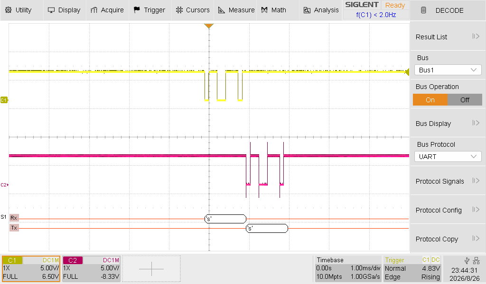
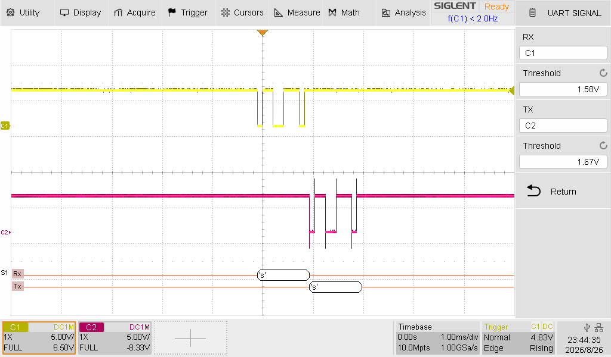
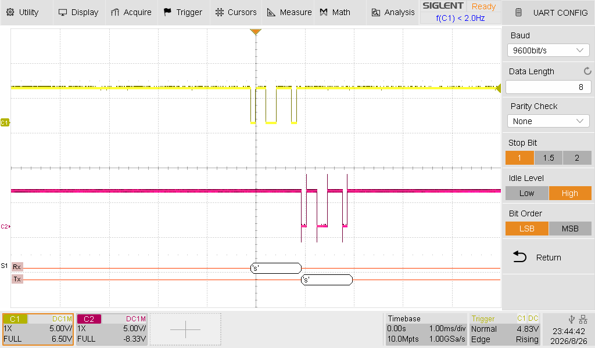

# Laboratoire 2 / Partie 1


## Partie 1:

- Test Serial


**NOTE** Les évaluations seront par partie. Garder votre montage fonctionnel pour chaque étape.

# Ligne Serial

La librairie Serial de Arduino utilise le protocole UART à la base. Dans les exemples fait dans le Lab 1, nous avons utilisé 9600 de BaudRate. 

Connecter la pin Tx et Rx de la ligne UART à votre oscilloscope.


> $\color{gray}{\text{MANIPULATION}}$ **Ligne Sérielle Tx et Rx**
>
> Écrire ce code dans un nouveau programme
> ```
> char receivedChar;
> boolean newData = false;
> 
> void setup() {
>     Serial.begin(9600);
>     Serial.println("<Arduino is ready>");
> }
> 
> void loop() {
>     recvOneChar();
>     showNewData();
> }
> 
> void recvOneChar() {
>     if (Serial.available() > 0) {
>         receivedChar = Serial.read();
>         newData = true;
>     }
> }
> 
> void showNewData() {
>     if (newData == true) {
>         Serial.print(receivedChar);
>         newData = false;
>     }
> }
> ```
> 
> Configurer votre Monitor sous Arduino pour aucun retour de caractère. 
> Ainsi que la vitesse à 9600.
> 


> $\color{gray}{\text{MANIPULATION}}$ **Oscilloscope config**
>
> Assurez-vous d'avoir votre sonde 1 sur la pin `Rx` et la 2 sur `Tx`
>
> Appuyer sur le bouton `Decode` sur l'oscilloscope et copier les configurations suivants:
>








> $\color{gray}{\text{MANIPULATION}}$ **Arduino Rx/Tx**
>
> En utilisant l'interface Monitor du Arduino IDE, envoyer des caractères.
> Pesez sur `Enter` pour valider votre envoi.
>
> Sur l'oscilloscope, utiliser le bouton `Normal` ou `Single` pour capturer l'envoi
>


> $\color{darkred}{\text{À VÉRIFIER}}$ **Rx/Tx Eval**
>
> Utiliser l'oscilloscope pour comprendre l'envoi (Et la réception) de data sur la ligne sérielle.
> 
> Une fois l'envoi fonctionnel, montrer à l'enseignant votre Monitor ainsi que votre oscilloscope.
> 
> 


> $\color{darkgreen}{\text{À VÉRIFIER}}$ **Question.docx**
> 
> Avant de passer à l'autre partie, lire la partie 1 et prendre votre capture 
> d'écran
>
> Pour capturer une image sur l'oscilloscope, vous pouvez:
> Configurer votre `save/recall` et ensuite utiliser `print` pour sauvegarder sur votre clé USB plus rapidement.

