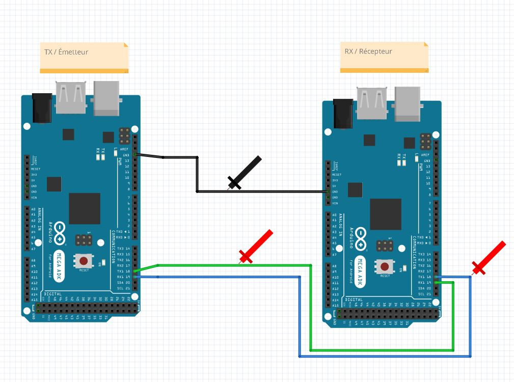

# Laboratoire 2 / Partie 3


## Partie 3:
- Communication intermatérielle


# Émetteur [Tx] - Récepteur [Rx] (Équipe de 2 seulement)

Le protocole UART est utilisé dans une communication bidirectionnel entre 2 machines. Nous allons procéder au branchement suivant:



Les pins sélectionnées sont `Tx1` et `Rx1`. 

Pour l'émetteur et récepteur, commencer par le code de la partie 1:

```
char receivedChar;
boolean newData = false;

void setup() {
    Serial.begin(9600);
    Serial.println("<Arduino is ready>");
}

void loop() {
    recvOneChar();
    showNewData();
}

void recvOneChar() {
    if (Serial.available() > 0) {
        receivedChar = Serial.read();
        newData = true;
    }
}

void showNewData() {
    if (newData == true) {
        Serial.print(receivedChar);
        newData = false;
    }
}
```

> $\color{gray}{\text{MANIPULATION}}$ **Ligne Sérielle Tx1**
>
> Pour les 2: Ajouter l'interface Serial1
> 
> `Serial1.begin(9600)`
> 
> Pour l'émetteur:
> L'envoie de data doit envoyer sur `Serial1`
>
> Pour le récepteur:
> La réception de data sur `Serial1`
>
>
> En utilisant l'interface Monitor du Arduino IDE (Émetteur), envoyer des caractères.
> Pesez sur `Enter` pour valider votre envoi.
>
> Sur l'oscilloscope, utiliser le bouton `Normal` ou `Single` pour capturer l'envoi
>

> $\color{darkred}{\text{À VÉRIFIER}}$ **Rx/Tx Eval**
>
> Utiliser l'oscilloscope pour comprendre l'envoi (Et la réception) de data sur la ligne sérielle 1.
> 
> Une fois l'envoi fonctionnel, montrer à l'enseignant votre Monitor ainsi que votre oscilloscope.
> 
> 
> 

> $\color{darkgreen}{\text{QUESTION}}$ **Question.docx**
> 
> Avant de passer à l'autre partie, lire la partie 3 et prendre votre capture 
> d'écran
>
> Pour capturer une image sur l'oscilloscope, vous pouvez:
> Configurer votre `save/recall` et ensuite utiliser `print` pour sauvegarder sur votre clé USB plus rapidement.


# Émetteur [Tx] - Récepteur [Rx] (Équipe de 3 seulement)

Pour l'équipe de 3, nous allons utiliser 2 Arduinos pour cette section. 

1 étudiant sur le rôle de l'émetteur, 2 pour récepteur

Le protocole UART est utilisé dans une communication bidirectionnel entre 2 machines. Nous allons procéder au branchement suivant:


Les pins sélectionnées sont `Tx1` et `Rx1`. 

Pour l'émetteur et récepteur, commencer par le code de la partie 1:

```
char receivedChar;
boolean newData = false;

void setup() {
    Serial.begin(9600);
    Serial.println("<Arduino is ready>");
}

void loop() {
    recvOneChar();
    showNewData();
}

void recvOneChar() {
    if (Serial.available() > 0) {
        receivedChar = Serial.read();
        newData = true;
    }
}

void showNewData() {
    if (newData == true) {
        Serial.print(receivedChar);
        newData = false;
    }
}
```

> $\color{gray}{\text{MANIPULATION}}$ **Ligne Sérielle Tx1**
>
> Pour les 2: Ajouter l'interface Serial1
> 
> `Serial1.begin(19200)`
> 
> Pour l'émetteur:
> L'envoie de data doit envoyer sur `Serial1`
>
> Pour le récepteur:
> La réception de data sur `Serial1`
>
> Sur l'oscilloscope: assurez-vous de capturer l'envoi en 19200 et non 9600
>
> En utilisant l'interface Monitor du Arduino IDE (Émetteur), envoyer des caractères.
> Pesez sur `Enter` pour valider votre envoi.
>
> Sur l'oscilloscope, utiliser le bouton `Normal` ou `Single` pour capturer l'envoi
>

> $\color{darkred}{\text{À VÉRIFIER}}$ **Rx/Tx Eval**
>
> Utiliser l'oscilloscope pour comprendre l'envoi (Et la réception) de data sur la ligne sérielle 1.
> 
> Une fois l'envoi fonctionnel, montrer à l'enseignant votre Monitor ainsi que votre oscilloscope.
> 
> 
> 

> $\color{darkgreen}{\text{QUESTION}}$ **Question.docx**
> 
> Avant de passer à l'autre partie, lire la partie 3 et prendre votre capture 
> d'écran
>
> Pour capturer une image sur l'oscilloscope, vous pouvez:
> Configurer votre `save/recall` et ensuite utiliser `print` pour sauvegarder sur votre clé USB plus rapidement.