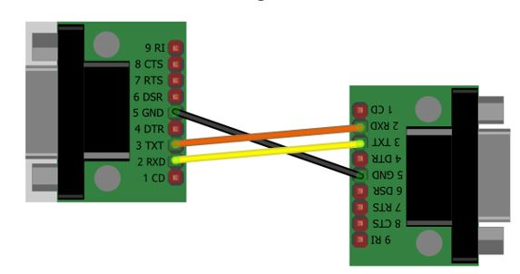
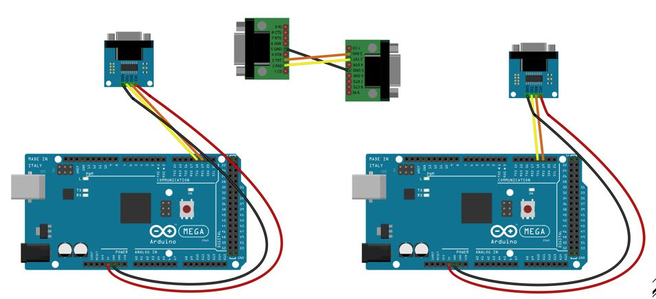

# Laboratoire 2 / Partie 4

## Partie 4:
- Communication RS232

# Émetteur [Tx] - Récepteur [Rx] (Équipe de 2 seulement)

Le protocole RS232 est l'ancêtre direct du UART. il s'agit du `même` protocole, mais avec signal inverser ET une plus grande tension. (Ancien standard tension + et -)

Entre les deux stations de travail (long fils), placer les Adaptateur DB-9

**NOTE** Entre les deux sections, si le cable USB n'est pas assez long, utilisez des pinces et des fils bananes.

TXD, RXD et GND peuvent ne pas suivre l'image. Il y a 2-3 différents modèles.

À côté des 2 arduinos, brancher le module RS232:

Avec le code de la partie 3 (Émetteur et Récepteur), brancher une sonde dans TXD et une autre dans RXD.

> $\color{gray}{\text{MANIPULATION}}$ **Ligne RS-232 TxD**
>
> 
> En utilisant l'interface Monitor du Arduino IDE (Émetteur), envoyer des caractères.
> Pesez sur `Enter` pour valider votre envoi.
>
> Sur l'oscilloscope, utiliser le bouton `Normal` ou `Single` pour capturer l'envoi
>
> Changer la config de protocole (Protocol Config) `Idle Level` à LOW
> 

> $\color{darkred}{\text{À VÉRIFIER}}$ **RS-232 Eval**
>
> Utiliser l'oscilloscope pour comprendre l'envoi (Et la réception) de data sur la ligne RS-232.
> 
> Une fois l'envoi fonctionnel, montrer à l'enseignant votre Monitor ainsi que votre oscilloscope.
> 
> 

> $\color{darkgreen}{\text{QUESTION}}$ **Question.docx**
> 
> Avant de passer à l'autre partie, lire la partie 4 et prendre votre capture 
> d'écran
>
> Pour capturer une image sur l'oscilloscope, vous pouvez:
> Configurer votre `save/recall` et ensuite utiliser `print` pour sauvegarder sur votre clé USB plus rapidement.

# Émetteur [Tx] - Récepteur [Rx] (Équipe de 3 seulement)

Le protocole RS232 est l'ancêtre direct du UART. il s'agit du `même` protocole, mais avec signal inverser ET une plus grande tension. (Ancien standard tension + et -)

Entre les deux stations de travail (long fils), placer les Adaptateur DB-9

**NOTE** Entre les deux sections, si le cable USB n'est pas assez long, utilisez des pinces et des fils bananes.

TXD, RXD et GND peuvent ne pas suivre l'image. Il y a 2-3 différents modèles.

À côté des 2 arduinos, brancher le module RS232:

Avec le code de la partie 3 (Émetteur et Récepteur), brancher une sonde dans TXD et une autre dans RXD.

> $\color{gray}{\text{MANIPULATION}}$ **Ligne RS-232 TxD**
>
> 
>
> Modifier le code pour avoir une bande de 9600 sur Serial1. Et 
> resélectionner une bande de 9600 sur la capture de l'oscilloscope. 
>
> En utilisant l'interface Monitor du Arduino IDE (Émetteur), envoyer des caractères.
> Pesez sur `Enter` pour valider votre envoi.
>
> L'Arduino IDE du récepteur doit aussi être ouvert et configurer pour la même fréquence que Serial
> 
> Sur l'oscilloscope, utiliser le bouton `Normal` ou `Single` pour capturer l'envoi
>
> Changer la config de protocole (Protocol Config) `Idle Level` à LOW
> 

> $\color{darkred}{\text{À VÉRIFIER}}$ **RS-232 Eval**
>
> Utiliser l'oscilloscope pour comprendre l'envoi (Et la réception) de data sur la ligne RS-232.
> 
> Une fois l'envoi fonctionnel, montrer à l'enseignant votre Monitor ainsi que votre oscilloscope.
> 
> 

> $\color{darkgreen}{\text{QUESTION}}$ **Question.docx**
> 
> Avant de passer à l'autre partie, lire la partie 4 et prendre votre capture 
> d'écran
>
> Pour capturer une image sur l'oscilloscope, vous pouvez:
> Configurer votre `save/recall` et ensuite utiliser `print` pour sauvegarder sur votre clé USB plus rapidement.
