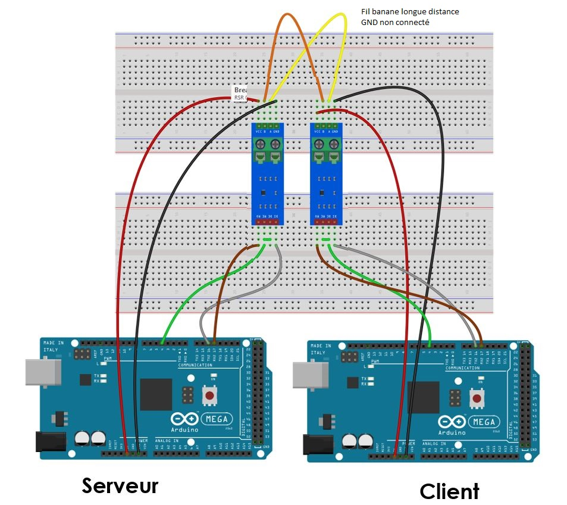
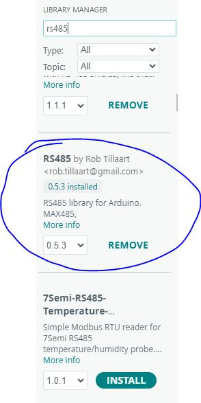

# Laboratoire 2 / Partie 5

## Partie 5:
- Communication RS485

# Émetteur [Tx] - Récepteur [Rx] (Équipe de 2 et 3)

Le protocole RS485 est un protocole dérivé de UART, mais qui est `Noise resistant`.

Pour ce travail, il s'agit d'un test de librairie et de profiter de l'interface UART sur Serial 2 cette fois (TX2, RX2)

Le fil `orange` et `jaune` peuvent être des fils bananes avec pinces si les 2 ordinateurs sont trop loin.

Pour ce test, désactivé le décodeur d'oscilloscope.

Pour le code, nous allons aussi utiliser une librairie déjà faite:

> $\color{gray}{\text{MANIPULATION}}$ **Ligne RS-485**
>
> 
> Installer la librairie RS485 (Pour Arduno 1.X, elle se trouve vers la fin, même avec le mot clé `RS485`)
>
> Une fois télécharger sur les 2 postes:
> Pour l'émetteur utiliser le programme: (Via les `examples`)
> 
> `RS485_MEGA_master_send_receive.ino`
>
> Pour le récepteur:
> 
> `RS485_MEGA_slave_send_receive.ino`
> 
> Sélectionner le baudrate de `115200` via votre moniteur sérielle
> 
> Regarder si les informations sont transmit correctement.
> 

> $\color{darkred}{\text{À VÉRIFIER}}$ **RS-485 Eval**
>
> Utiliser l'oscilloscope sur R0 des 2 modules pour lire la réception des 2 
> lignes
> 
> Une fois l'envoi fonctionnel, montrer à l'enseignant votre Monitor ainsi que votre oscilloscope.
> 
> 

> $\color{darkgreen}{\text{QUESTIONS}}$ **Remettez le document questions.docx rempli via Teams/Assignments**
>
> Laboratoire 2 fini!

