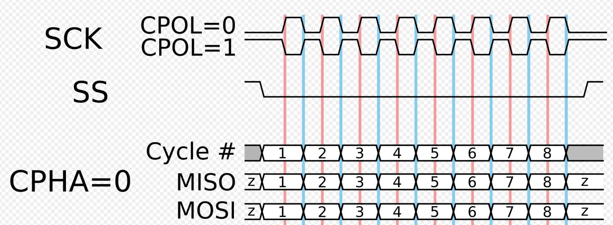
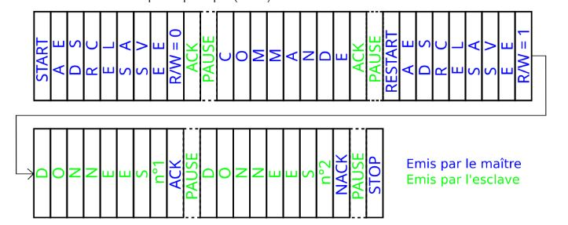

# Laboratoire 3
Énoncé: I2C et SPI

Pondération:
- Partie 1: TBD%
- Partie 2: TBD%
- Partie 3: TBD%
- Partie 4: TBD%
- Partie Extra: 1% (Valeur absolue sur le cours 32A)

## Matériels
- 1 X Clé USB
- 1 X Carte SD
- 1 X Arduino Mega 2560 Rev3
- 1 X Fils USB (Type A -- Type B)
- 1 X Plaquette de montage
- 3 X Bouton Poussoir
- Paquet de jumper male-male
- Paquet de jumper male-femelle
- 1 X module RTC (Real-time clock)
- 1 x module Afficheur 128x64
- 1 x module Lecteur de carte SD

## Équipements:
- Oscilloscope
- Multimètre
- Sonde logique
- Kit de l'étudiant

## Bloc théorique

Le laboratoire sera sur 3 semaines et est divisé en 3 étapes.

- Communication avec un RTC clock
- Communication avec un afficheur
- Communication avec un lecteur de carte Micro SD

Le matériel utilisé:

- Module RTC

- Module Afficheur

- Module Lecteur de carte Micro SD

L'ensemble des modules vont communiquer soit en SPI ou en I2C (En anglais `I` `Square` `C`)

Nous allons faire un cours sur les trames en détail autour du début de ce laboratoire.

Voici un exemple de trame SPI:

Et voici un pseudo-chronogramme d'états sur la ligne SDA pour I2C:

## Oscilloscope mode numérique

Pour capturer les prochains signaux, nous allons utiliser un analyseur logique. Le but est de nullifier l'impact des sondes classiques (En terme d'impédance) pour avoir un signal rapide et avec moins de bruit.

Brancher votre kit de sonde numérique dans le port d'entrée de type PCIe. Au lieu d'appuyer sur `1` ou `2` pour les sondes, appuyer sur digital, enlever l'ensemble des signaux.

Pour les protocoles de chaque partie, nous allons utiliser l'option `Decode` encore une fois, mais en mode `SPI` ou `I2C`.

## Datasheets
- atmel-2549-8-bit-avr-microcontroller-atmega640-1280-1281-2560-2561_datasheet.pdf
- arduino-mega-2560-datasheet.pdf
- SSD1306.pdf (Afficheur)

## Pinout
- arduino-mega2560-pinout.pdf
- arduino-mega2560-schematic.pdf

#### Partie 1:

- Communication avec un RTC clock

#### Partie 2:

- Communication avec un afficheur

#### Partie 3:

- Communication avec un lecteur de carte Micro SD

#### Partie 4:

- Ensemble

#### Partie Extra:

- Ensemble Extra