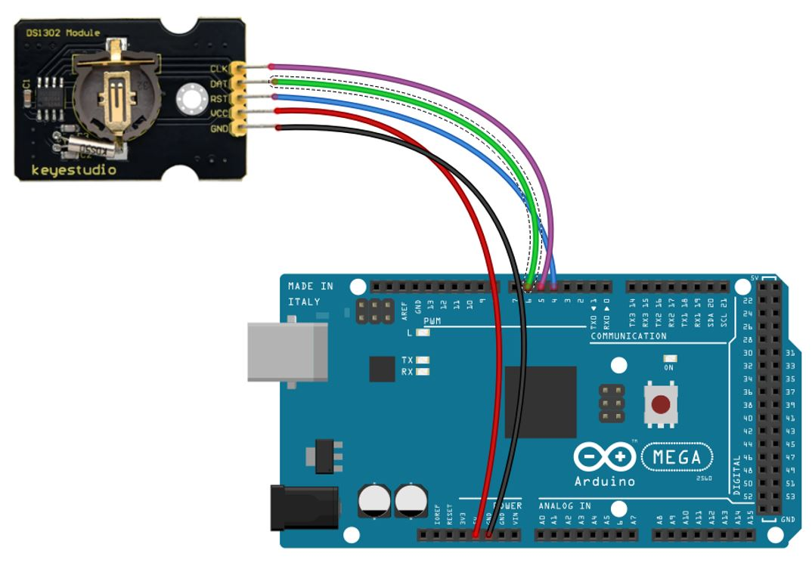
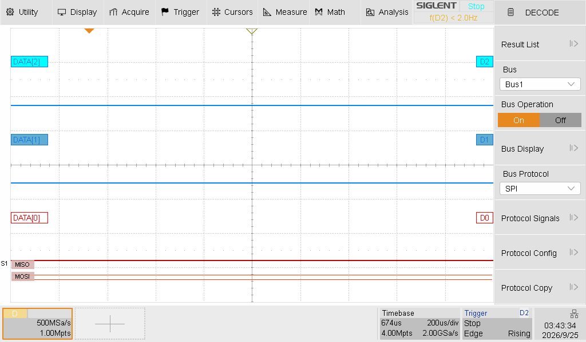
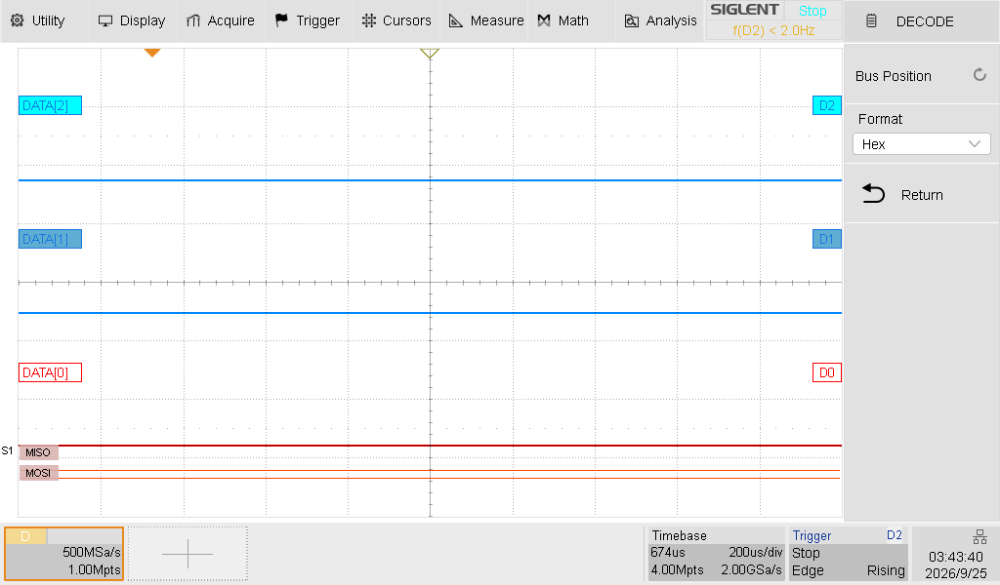
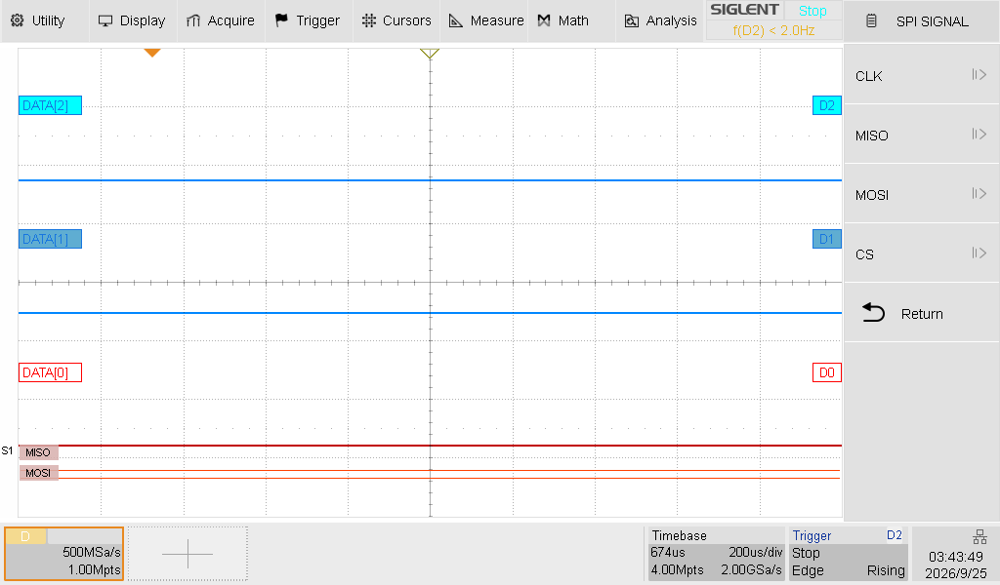
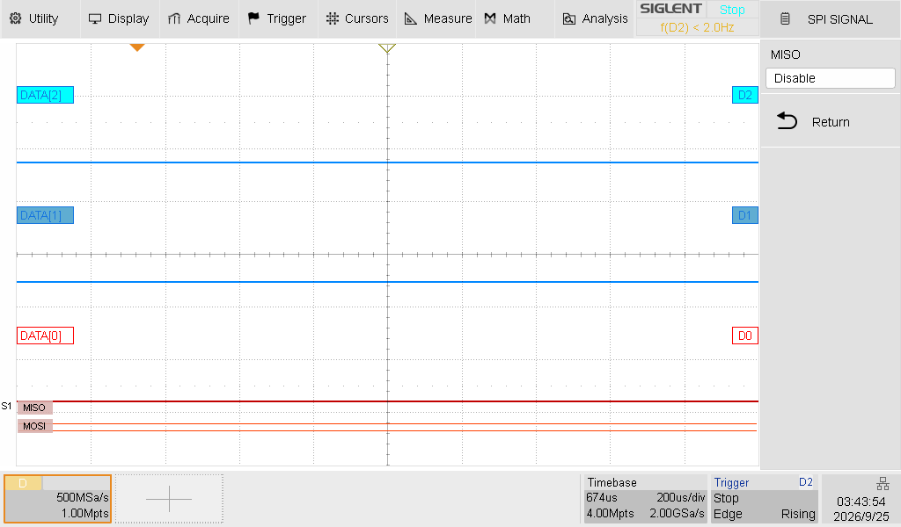
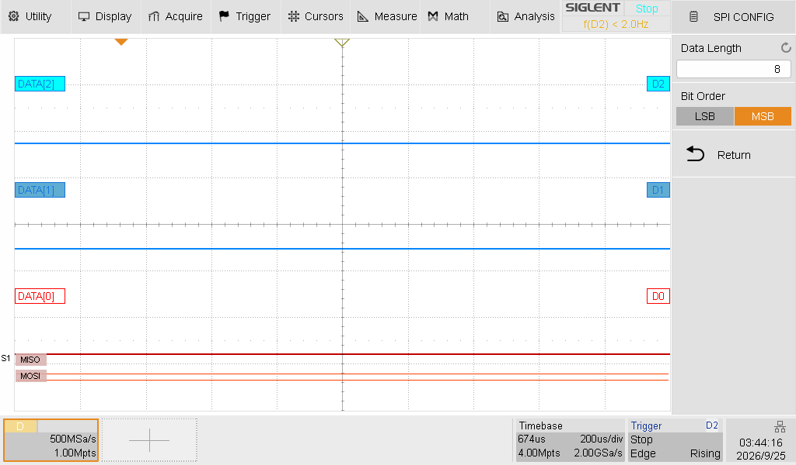

# Laboratoire 3 / Partie 1


## Partie 1:

- Communication avec un RTC clock

Premier le module de RTC (Real Time Clock) et brancher comme ceci:



> $\color{gray}{\text{MANIPULATION}}$ **RTC**
>
> Aller chercher une autre librarie, chercher `DS1302` et prendre `Rtc by Makuna`
>
> Faire un nouveau sketch avec le code suivant:
>

```
// CONNECTIONS:
// DS1302 CLK/SCLK --> 5
// DS1302 DAT/IO --> 6
// DS1302 RST/CE --> 4
// DS1302 VCC --> 3.3v - 5v
// DS1302 GND --> GND

#include <RtcDS1302.h>

ThreeWire myWire(6,5,4); // IO, SCLK, CE
RtcDS1302<ThreeWire> Rtc(myWire);

void setup () 
{
    Serial.begin(57600);

    Serial.print("compiled: ");
    Serial.print(__DATE__);
    Serial.println(__TIME__);

    Rtc.Begin();

    RtcDateTime compiled = RtcDateTime(__DATE__, __TIME__);
    printDateTime(compiled);
    Serial.println();

    if (!Rtc.IsDateTimeValid()) 
    {
        // Common Causes:
        //    1) first time you ran and the device wasn't running yet
        //    2) the battery on the device is low or even missing

        Serial.println("RTC lost confidence in the DateTime!");
        Rtc.SetDateTime(compiled);
    }

    if (Rtc.GetIsWriteProtected())
    {
        Serial.println("RTC was write protected, enabling writing now");
        Rtc.SetIsWriteProtected(false);
    }

    if (!Rtc.GetIsRunning())
    {
        Serial.println("RTC was not actively running, starting now");
        Rtc.SetIsRunning(true);
    }

    RtcDateTime now = Rtc.GetDateTime();
    if (now < compiled) 
    {
        Serial.println("RTC is older than compile time!  (Updating DateTime)");
        Rtc.SetDateTime(compiled);
    }
    else if (now > compiled) 
    {
        Serial.println("RTC is newer than compile time. (this is expected)");
    }
    else if (now == compiled) 
    {
        Serial.println("RTC is the same as compile time! (not expected but all is fine)");
    }
}

void loop () 
{
    RtcDateTime now = Rtc.GetDateTime();

    printDateTime(now);
    Serial.println();

    if (!now.IsValid())
    {
        // Common Causes:
        //    1) the battery on the device is low or even missing and the power line was disconnected
        Serial.println("RTC lost confidence in the DateTime!");
    }

    delay(10000); // ten seconds
}

#define countof(a) (sizeof(a) / sizeof(a[0]))

void printDateTime(const RtcDateTime& dt)
{
    char datestring[26];

    snprintf_P(datestring, 
            countof(datestring),
            PSTR("%02u/%02u/%04u %02u:%02u:%02u"),
            dt.Month(),
            dt.Day(),
            dt.Year(),
            dt.Hour(),
            dt.Minute(),
            dt.Second() );
    Serial.print(datestring);
}
```


> $\color{darkred}{\text{À VÉRIFIER}}$ **RTC Eval**
>
> Avec votre port série, trouver la fréquence d'envoi du code (Serial.b...)
>
> Une fois le code fonctionnel, prenez un moment pour le comprendre et expliquer à l'enseignant. Appeler l'enseignant pour montrer le circuit, le port Série ET l'explication
> 

> $\color{gray}{\text{MANIPULATION}}$ **RTC Oscilloscope**
>
> L'envoi de data se fait à une fréquence déterminer. Sans modifier le programme, brancher l'oscilloscope sur les pin 4,5,6 (Rst, Dat et Clk) via l'analyseur logique
>
> Essayer de capturer une trame en entier. 
>
> Rst = CS
> Dat = MOSI
> Clk = SCK
> X = MISO (Disable)
>
>












> $\color{darkgreen}{\text{QUESTION}}$ **Question.docx**
> 
> Avant de passer à l'autre partie, connecter votre oscilloscope sur la Pin RST, CLK et DAT et avec l'encoder (`Option decode`), capturer une trame SPI qui est décodé correctement.

