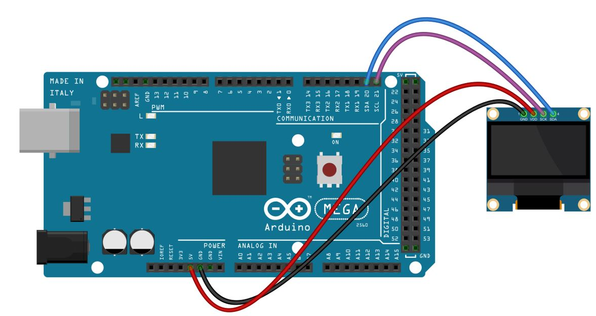
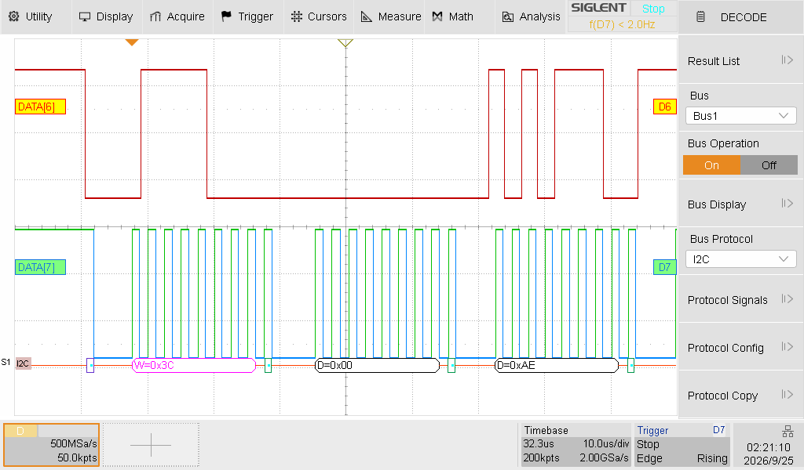
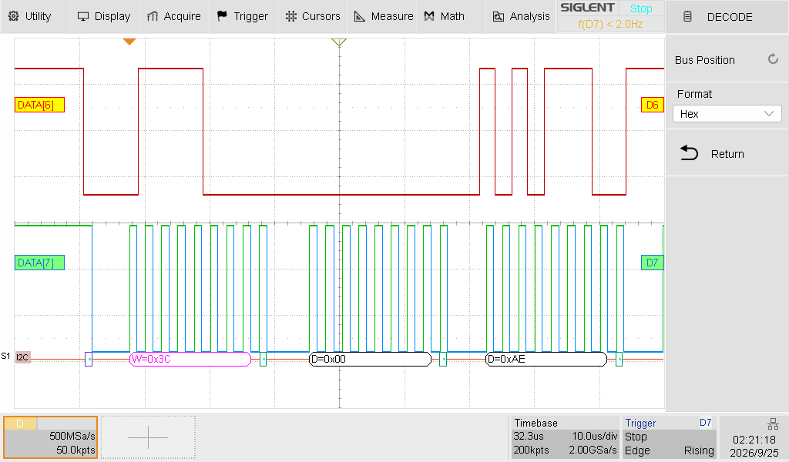
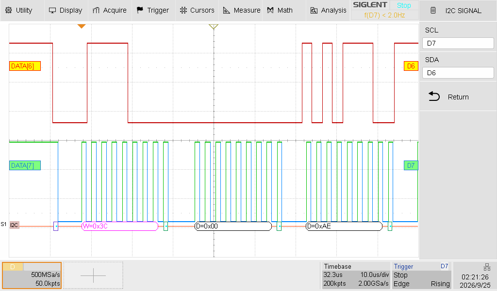

# Laboratoire 3 / Partie 2

## Partie 2:

- Communication avec un afficheur

Nous allons travailler avec le module OLED SSD1306:

**NOTE**: Ajouter à votre branchement actuelle, garder votre RTC.

> $\color{gray}{\text{MANIPULATION}}$ **Hello World OLED SSD1306**
>
> À l'aide du Arduino IDE, chercher une librairie pour le SSD1306.
> (Prendre la version Adafruit)
> 
> Regarder derrière votre afficheur OLED, trouver la mention `IIC adress select`.
> La résistance est connecté à la bonne adresse, soit 0x78 ou 0x7A.
> 
> L'adresse I2C est sur 7 bits, dans notre cas, en utilisant la librairie `Wire`, nous devons la traduire en 8 bits à l'aide d'un Bit shift vers le LSD
>
> Exemple: 0x01110110 --> 0x00111011
> Trouver votre adresse
>
> Utiliser l'exemple: `Adafruit SSD1306/ssd1306_128_64_i2c`
>
> Changer votre `SCREEN_ADDRESS` pour la bonne valeur 8 bit
>
> Lancer votre programme et assurez-vous que l'écran lance l'animation des divers fonctions en passant par le Logo d'Adafruit.
> 
>

> $\color{darkred}{\text{À VÉRIFIER}}$ **Example running**
>
> Une fois le démo fonctionnel, montrer le à l'enseignant.
> 
> 

> $\color{gray}{\text{MANIPULATION}}$ **Oscillo I2C**
>
> À l'aide de l'analyseur logique sur l'oscilloscope, capturer une trame. Voici les configurations de `Decode` pour I2C
> 

> $\color{darkgreen}{\text{QUESTION}}$ **Question.docx**
> 
> Avant de passer à l'autre partie, connecter votre oscilloscope sur la Pin SCL et SDA et avec l'encoder (`Option decode`), capturer une trame I2C qui montre l'adressage que vous avez calculé en haut.
>
> 

