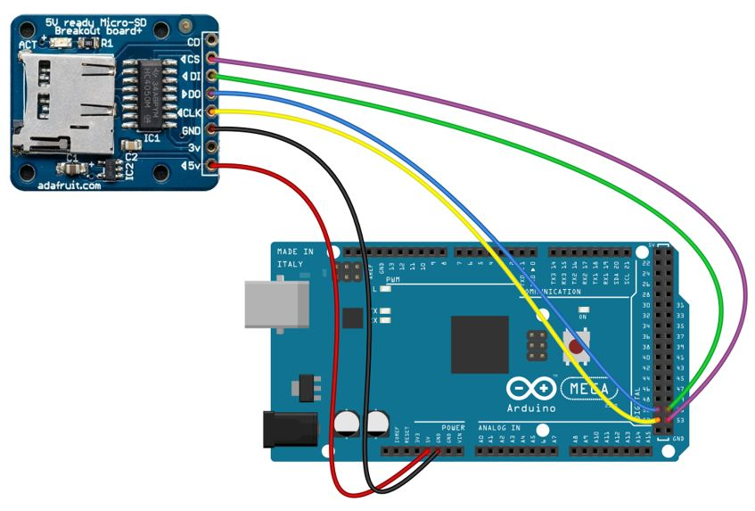

# Laboratoire 3 / Partie 3


## Partie 3:

- Communication avec un lecteur de carte Micro SD

**NOTE**: Ajouter à votre branchement actuelle

**NOTE**: Quand la période de laboratoire est fini, garder votre circuit, mais enlever les modules pour le prochain groupe. Pour les prochaines partie, vous allez avoir les 3 modules ET un bouton poussoir en plus.



> $\color{gray}{\text{MANIPULATION}}$ **Branchement**
>
> Ajouter le lecteur de carte SD au montage. Placer une carte Micro SD dans la fente.
>
> Pour la carte SD, le Arduino IDE, utilise par défaut 'Wire.h' et 'SD.h' dans sa liste de librairies. Simplement l'inclure, pas besoin de télécharger le tout.
>
> Faire un nouveau sketch avec le code suivant ET configurer `chipSelect` sur la bonne pin `SS` (Utiliser le pinout disponible dans ce Git repo):
>

```
/*
  SD card test

  This example shows how use the utility libraries on which the'
  SD library is based in order to get info about your SD card.
  Very useful for testing a card when you're not sure whether its working or not.

  The circuit:
    SD card attached to SPI bus as follows:
 ** MOSI - pin 11 on Arduino Uno/Duemilanove/Diecimila
 ** MISO - pin 12 on Arduino Uno/Duemilanove/Diecimila
 ** CLK - pin 13 on Arduino Uno/Duemilanove/Diecimila
 ** CS - depends on your SD card shield or module.
 		Pin 4 used here for consistency with other Arduino examples


  created  28 Mar 2011
  by Limor Fried
  modified 9 Apr 2012
  by Tom Igoe
*/
// include the SD library:
#include <SPI.h>
#include <SD.h>

// set up variables using the SD utility library functions:
Sd2Card card;
SdVolume volume;
SdFile root;

// change this to match your SD shield or module;
// Arduino Ethernet shield: pin 4
// Adafruit SD shields and modules: pin 10
// Sparkfun SD shield: pin 8
// MKRZero SD: SDCARD_SS_PIN
const int chipSelect = ;

void setup() {
  // Open serial communications and wait for port to open:
  Serial.begin(9600);
  while (!Serial) {
    ; // wait for serial port to connect. Needed for native USB port only
  }


  Serial.print("\nInitializing SD card...");

  // we'll use the initialization code from the utility libraries
  // since we're just testing if the card is working!
  if (!card.init(SPI_HALF_SPEED, chipSelect)) {
    Serial.println("initialization failed. Things to check:");
    Serial.println("* is a card inserted?");
    Serial.println("* is your wiring correct?");
    Serial.println("* did you change the chipSelect pin to match your shield or module?");
    while (1);
  } else {
    Serial.println("Wiring is correct and a card is present.");
  }

  // print the type of card
  Serial.println();
  Serial.print("Card type:         ");
  switch (card.type()) {
    case SD_CARD_TYPE_SD1:
      Serial.println("SD1");
      break;
    case SD_CARD_TYPE_SD2:
      Serial.println("SD2");
      break;
    case SD_CARD_TYPE_SDHC:
      Serial.println("SDHC");
      break;
    default:
      Serial.println("Unknown");
  }

  // Now we will try to open the 'volume'/'partition' - it should be FAT16 or FAT32
  if (!volume.init(card)) {
    Serial.println("Could not find FAT16/FAT32 partition.\nMake sure you've formatted the card");
    while (1);
  }

  Serial.print("Clusters:          ");
  Serial.println(volume.clusterCount());
  Serial.print("Blocks x Cluster:  ");
  Serial.println(volume.blocksPerCluster());

  Serial.print("Total Blocks:      ");
  Serial.println(volume.blocksPerCluster() * volume.clusterCount());
  Serial.println();

  // print the type and size of the first FAT-type volume
  uint32_t volumesize;
  Serial.print("Volume type is:    FAT");
  Serial.println(volume.fatType(), DEC);

  volumesize = volume.blocksPerCluster();    // clusters are collections of blocks
  volumesize *= volume.clusterCount();       // we'll have a lot of clusters
  volumesize /= 2;                           // SD card blocks are always 512 bytes (2 blocks are 1KB)
  Serial.print("Volume size (Kb):  ");
  Serial.println(volumesize);
  Serial.print("Volume size (Mb):  ");
  volumesize /= 1024;
  Serial.println(volumesize);
  Serial.print("Volume size (Gb):  ");
  Serial.println((float)volumesize / 1024.0);

  Serial.println("\nFiles found on the card (name, date and size in bytes): ");
  root.openRoot(volume);

  // list all files in the card with date and size
  root.ls(LS_R | LS_DATE | LS_SIZE);
}

void loop(void) {
}
```


> $\color{darkred}{\text{À VÉRIFIER}}$ **Valider une carte SD fonctionne**
>
> Programmer le tout et ouvrir le moniteur sérielle.
>
> Le message doit être `valide`:
>
> Initializing SD card...Wiring is correct and a card is present.
> 
> Card type:         SDHC
> Clusters:          ....
> Blocks x Cluster:  ......
> Total Blocks:      ............
> 
> Montrer le tout à l'enseignant
> 


> $\color{gray}{\text{MANIPULATION}}$ **Branchement**
>
>
> Nous allons tester l'écrire d'un fichier, garder votre programme en haut (Ce dernier peut trouver les fichiers)
>
> Faire un nouveau sketch avec le code suivant ET configurer `SD.begin(10)` sur la bonne pin `SS` (Utiliser le pinout disponible dans ce Git repo):
>
> Executer une fois ce programme pour créer le fichier et l'ancien pour s'assurer qu'il est bien présent.
>


```

#include <SPI.h>
#include <SD.h>
File myFile;
void setup() {
// Open serial communications and wait for port to open:
Serial.begin(9600);
while (!Serial) {
; // wait for serial port to connect. Needed for native USB port only
}
Serial.print("Initializing SD card...");
if (!SD.begin(10)) {
Serial.println("initialization failed!");
while (1);
}
Serial.println("initialization done.");
// open the file. note that only one file can be open at a time,
// so you have to close this one before opening another.
myFile = SD.open("test.txt", FILE_WRITE);
// if the file opened okay, write to it:
if (myFile) {
Serial.print("Writing to test.txt...");
myFile.println("This is a test file :)");
myFile.println("testing 1, 2, 3.");
for (int i = 0; i < 20; i++) {
myFile.println(i);
}
// close the file:
myFile.close();
Serial.println("done.");
} else {
// if the file didn't open, print an error:
Serial.println("error opening test.txt");
}
}
void loop() {
// nothing happens after setup
}
```

> $\color{darkred}{\text{À VÉRIFIER}}$ **Valider une carte SD écrit**
>
> Programmer le tout et ouvrir le moniteur sérielle.
>
> Le message doit être `valide`:
>
> Initializing SD card...initialization done.
> Writing to test.txt...done.
>
> Et avec le premier programme:
>
> ...
> 
> Files found on the card (name, date and size in bytes): 
> TEST.TXT      2000-01-01 01:00:00 224
> 
> (La date sera invalide)
> 

> $\color{darkgreen}{\text{QUESTION}}$ **Question.docx**
> 
> Avant de passer à l'autre partie, répondre à la question sur la partie 3.
>

