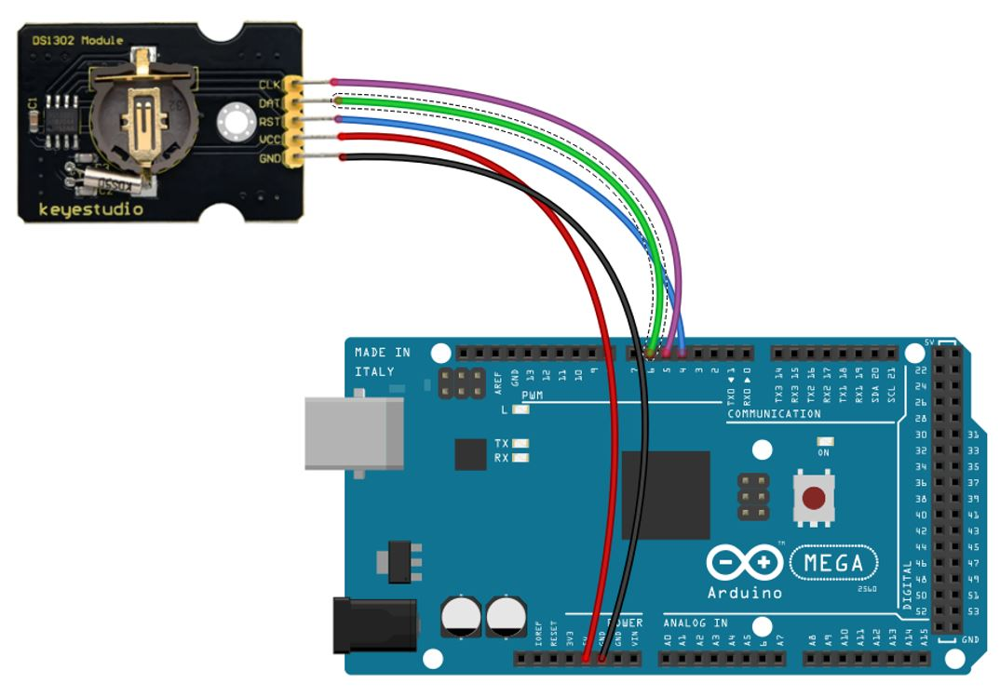

# Laboratoire 3 / Partie 4


## Partie 4:

- Ensemble

La partie 4 teste l'ensemble du circuit, voici le branchement à nouveau de chaque élément:

RTC:



Display:


Card:


Et maintenant, ajouter un bouton sur **n'importe quelle** IO disponible (Mode Pull-Up)


> $\color{gray}{\text{MANIPULATION}}$ **Exercice complet**
>
> Le but de cette exercice est de former un programme utilisant l'ensemble du materiels pour simuler un environnement multri-protocolaire.
>
> 
>  Avec l'aide des codes donner en exemple, créer un nouveau programme avec ces specifications:
>
> ```
> # Inclure l'ensemble des librairies ET les variables utilisés 
> # (En define ou en variable)
> 
> 
> 
> # Section Setup:
> # Initialiser le port Sérielle à 9600
> # Placer votre configuration de bouton poussoir en Input-pullup
> # Démarrer votre module RTC
> # S'assurer que le RTC est à jour (L'heure est fonctionnel)
> # Démarrer votre module d'affichage OLED
> # Afficher le texte: 'En attente du bouton' sur le OLED
> # Démarrer votre module de carte SD et effectuer la vérification s'il y a une carte valide (En cas de carte invalide, écrire qu'il y a une erreur sur le porte sérielle)
> 
> # Section Loop:
> # Quand on appuie sur le bouton:
> #    Ajouter un println qui mentionne que le bouton est appuyez
> #    Le temps du RTC est lu
> #    L'affichage OLED se met à jour et montre le temps du RTC dans le format de votre choix
> #    L'heure est sauvegarder dans un fichier appelé 'time.txt'
> #    N'oubliez pas de fermer le fichier si on veut retirer la carte SD
> #    Faire un 'delay' de 500ms pour éviter les écritures multiples
> ```
>


> $\color{darkred}{\text{À VÉRIFIER}}$ **Écriture temps carte SD**
>
> Montrer le demo à l'enseignant. 
> 
> L'enseignant va vérifier si le fichier de la carte Micro SD est exactement le même que le contenu sérielle. 
> 
> Le fichier peut avoir d'autre informations, les dernières lignes doivent cependant être le temps du RTC montrer dans le Moniteur Sérielle
> 
> 
