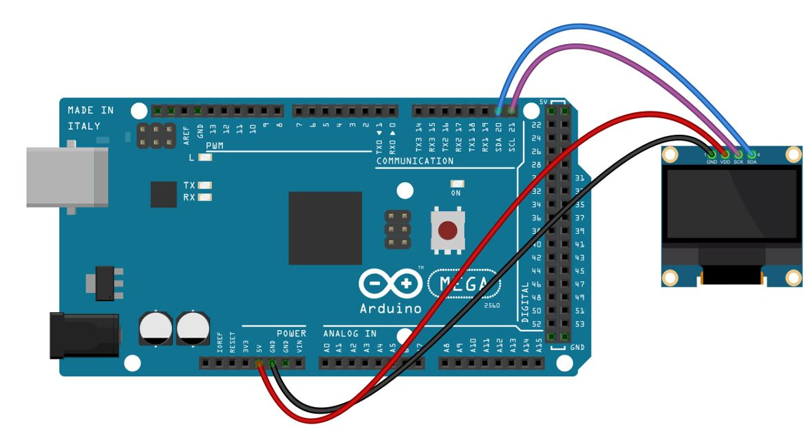
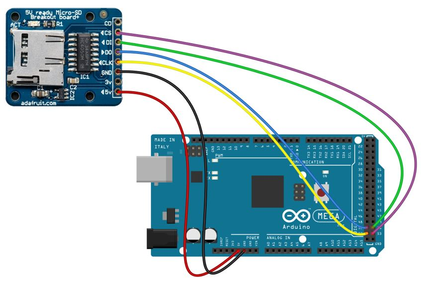

# Laboratoire 3 / Partie 5


## Partie 5:

- Ensemble 2

La partie 5 teste l'ensemble du circuit, voici le branchement à nouveau de chaque élément nécessaire:


Display:



Card:



Et maintenant, ajouter un bouton sur **n'importe quelle** IO disponible (Mode Pull-Up)


> $\color{gray}{\text{MANIPULATION}}$ **Exercice complet 2**
>
> Un autre programme à faire pour tester l'ensemble du matériel.
>
> Placer le fichier `drawing.txt` sur votre carte SD
>
> Demander à l'enseignant si vous n'avez pas d'adaptateur SD ou USB pour le télécharger
> 
>  Avec l'aide des codes donner en exemple, créer un nouveau programme avec ces spécifications:
>
> ```
> # Inclure l'ensemble des librairies ET les variables utilisés 
> # (En define ou en variable)
> 
> 
> 
> # Section Setup:
> # Initialiser le port Sérielle à 9600
> # Placer votre configuration de bouton poussoir en Input-pullup
> # Démarrer votre module d'affichage OLED
> # Afficher le texte: 'Start' sur le OLED
> # Démarrer votre module de carte SD et effectuer la vérification s'il y a une carte valide (En cas de carte invalide, écrire qu'il y a une erreur sur le porte sérielle)
> 
> # Section Loop:
> # Quand on appuie sur le bouton:
> #    Ajouter un println qui mentionne que le bouton est appuyez
> #    Lire le fichier drawing.txt 
> #    Associer les '0' à des pixels vide et des '1' à des pixels rempli
> #    Vidé l'affichage du OLED
> #    L'affichage OLED se met à jour et dessiner l'image de 32x32 du drawing.txt (Coordonné 0+x,10)
> #    x = x + 1
> #    (L'image se déplace vers la droite)
> #    Si x > 128-32 : x = 0
> #    N'oubliez pas de fermer le fichier si on veut retirer la carte SD
> #    Faire un 'delay' de 200ms pour éviter les écritures multiples
> ```
>
> Pour lire le fichier, voici un morceau de code utile
>
> ```
> // Préparer un array
> char line[LOGO_WIDTH];
> // Vider le display
> display.clearDisplay();
> // Lire un fichier
> File myFile = SD.open("DRAWING.TXT", FILE_READ);
> for (int y=0; y<LOGO_HEIGHT; y++)
>     {
>       myFile.seek((LOGO_WIDTH+2)*y); // Inclus \r et \n
>       myFile.read(line, LOGO_WIDTH);
>       for (int x=0; x<LOGO_WIDTH; x++) {
>         if (line[x] == '1'){
>           // Dessiner un pixel
>         }
>       }
>     }
> // Toujours mettre à jour
> display.display();
> ```
> 

> $\color{darkred}{\text{À VÉRIFIER}}$ **Animation logo**
>
> Montrer le demo à l'enseignant. 
> 
> L'enseignant va vérifier si l'affichage est fonctionnel.
> 
> 
> 