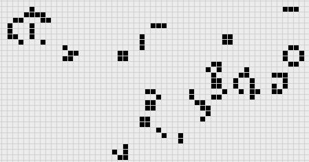

# Laboratoire 3 / Partie Extra


## Partie Extra:

- Ensemble Extra

Pour cette section, uniquement l'écran et le bouton sont nécessaire

Display:


Ajouter un bouton sur **n'importe quelle** IO disponible (Mode Pull-Up)

Dans les années 1970, un mathématicien a voulu créer une simulation gigantesque. Le but était simple, créer un ecosysteme macroscopique avec des composants microscopique.

Il a developpé 'The Game of Life', un système de simulation très simple qui prend des cellules (ici des zones de pixels) et les contrôles via leur voisin.

Voici un exemple:



Les règles de ce système sont très simple:

- Chaque cellule entourée de moins de 2 voisins meurt
- Chaque cellule entourée de 2 ou 3 continue à vivre
- Chaque cellule entourée de plus de 3 voisins meurt
- Toute cellule morte entourée de exactement 3 voisins sera remis à la vie

Le but de cette simulation est de créer un ecosystème qui peut interagir, mais uniquement via une distance 1. L'ensemble forme cependant un ecosystème complet. Il y a plusieurs implementation existante de ce système. 

L'exercice ici est de prendre un exemple fonctionnel ET de l'adapter à votre montage.

Voici quelques liens utiles:

- Wiki et simulation du Game of Life de John Conway: https://en.wikipedia.org/wiki/Conway%27s_Game_of_Life
- Implementation Arduino: https://github.com/rhammell/pyportal-game-life/tree/main

> $\color{gray}{\text{MANIPULATION}}$ **Game Of Life par John Conway**
>
> Commencer par prendre le fichier Arduino dans le repos Git de pyportal ci-dessus
> 
> Au lieu d'utiliser l'afficheur: ILI9341, modifier le code pour utiliser le SSD1306 OLED
>
> Ajuster la taille de l'écran
>
> Ajuster la taille des cellules à 4
>
> Les cellules vivants sont des pixels allumé. Les cellules mortes sont des pixels éteint
> 
> Dans la section setup, s'assurer d'initialiser notre écran, et votre button
> 
> Dans la section loop:
> 
> S'assurer que le `initGame` soit contrôler par votre bouton poussoir (Avec un rebound de 500ms)
>
> Si le bouton n'est pas enfoncé, effectuer des  `stepGame` et `drawGame`
> avec un delai de 100ms à la fin
>
> Faire fonctionner `drawGame` selon le contrôle du SSD1306 OLED
>
> Changer l'allocation dynamique de `game` et `temp_game`
> **Faire un tableau fixe, mais transformer num_cols/num_rows en define**
>
> Avec num_cols/num_rows, le type est redefini par un entier **positif**, dans countNeighbors, assurez-vous d'utiliser un cast 
>
> ```
> int newX = (x + i + int(num_rows)) % int(num_rows);
> int newY = (y + j + int(num_cols)) % int(num_cols);
> ```
>

> $\color{darkred}{\text{À VÉRIFIER}}$ **Game of Life Eval**
>
> Montrer le demo à l'enseignant votre simulation du Game of Life
> (Pour 1 %)
> 

> $\color{darkred}{\text{À VÉRIFIER}}$ **Game of Life Eval (Advanced)**
>
> Pour 1 % supplémentaire, placer la `cell_size` à 2 et essayer de compiler votre programme
> 
> Votre espace sera insuffisant, mais il y a une méthode pour sauver plusieurs octets!
> 

> $\color{darkred}{\text{À VÉRIFIER}}$ **Game of Life Eval (Mega Advanced)**
>
> Pour 1 % supplémentaire, modifier la règle du système 
> de `B3/S23` pour `B34/S23
> 
> Votre espace sera insuffisant, mais il y a une méthode pour sauver plusieurs octets!
> 
